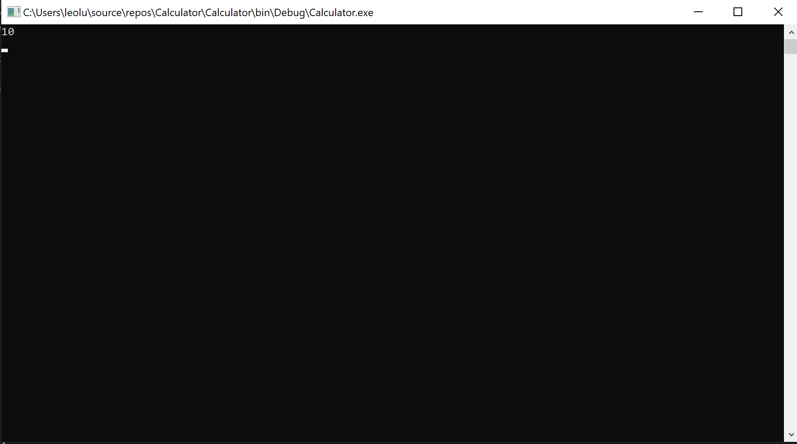
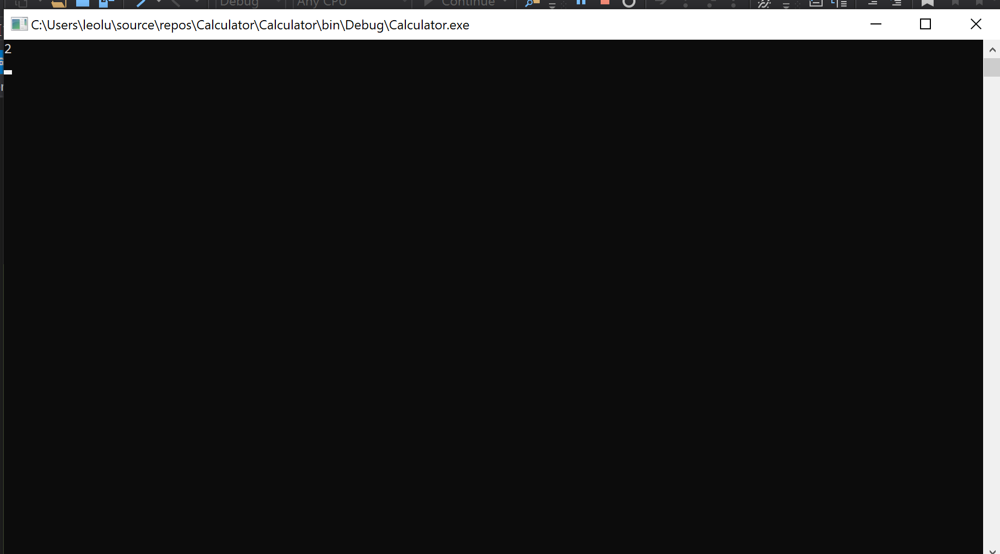

# Prework-Calculator

# Application Instructions
To run the application, clone it into Visual Studio and then run it either using debug, or the start button. 

## Add Method Result

## Subtraction Method Result

## Multiplication Method Result

## Division Method Result

